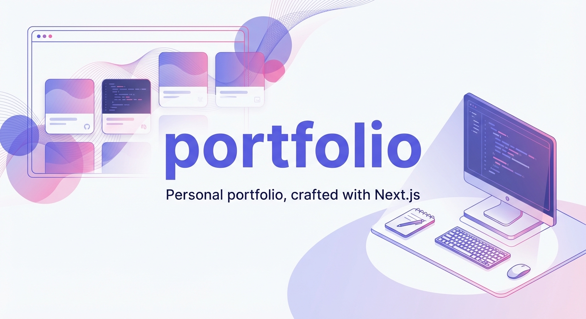

# Portfolio Website

<picture>
  <source media="(prefers-color-scheme: dark)" srcset="assets/banner.dark.png" />
  <source media="(prefers-color-scheme: light)" srcset="assets/banner.light.png" />
  
</picture>

My portfolio website to showcase some of the projects I have made to employers, clients and friends.